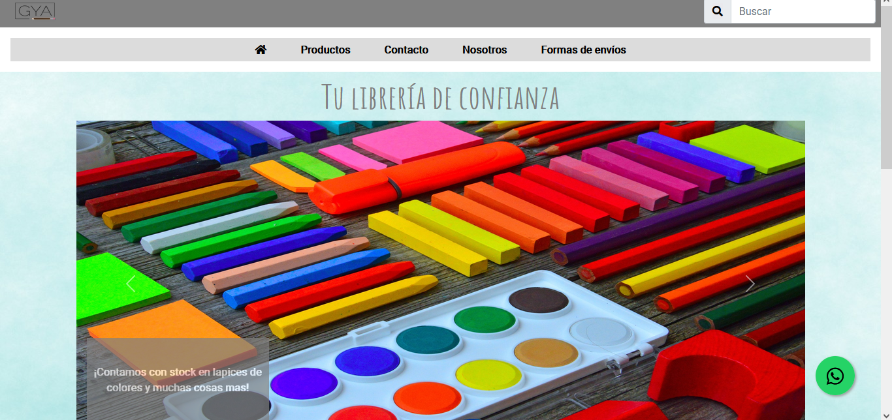
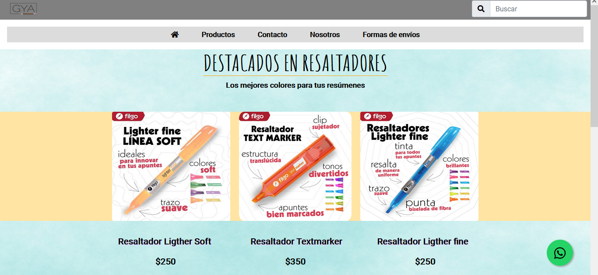
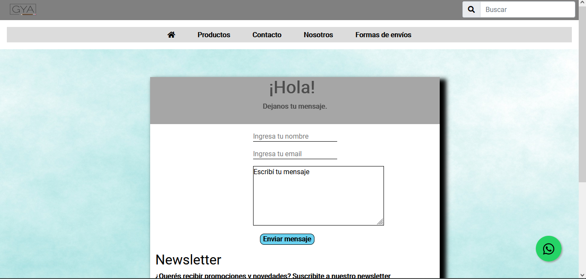

# Gya libreria
Este proyecto fue realizado en el curso de desarrollo web de CoderHouse. Se realizo con HTML, CSS Y BOOSTRAP.
La idea del proyecto era crear un ecommerce muy basico con 5 secciones: Inicio, Productos, Contacto, Nosotros y formas de envios.

